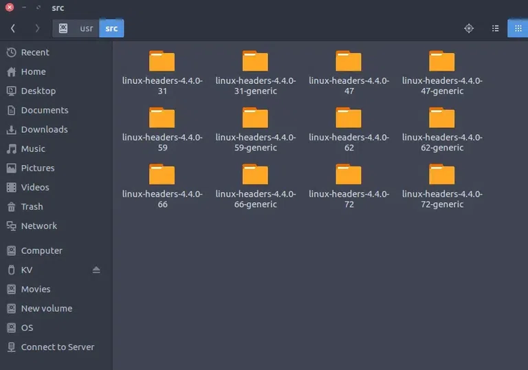

# Linux

Client OS: Windows 10,7,Vista,XP, Ubuntu Desktop
Server OS: RedHat, Ubuntu, Suse, BSD, Windows 2016, 2012, 2008 R/2

Linux -> Security, Stable, Better Performance (as it uses cli),

# Commands:

hostname : shows hostname
hostnamectl : Shows host configurations details
ifconfig : shows ip configuration
pwd: present working directory
ls : list files
ll : list files with permissions
ls -al : 
mkdir : to make directory
cd : to change directory
rmdir : to remove folder
rm : remove file
rmdir -rf : remove folder recursive forcely
touch : to create files
nano /vi :to edit file
useradd <name> : to create a user
passwd <name> : to set password for user
ps : process information
cat : read file
lsblk : list blocks

Linux Folder structure:

1. / (Root): 

Primary hierarchy root and root directory of the entire file system hierarchy. 

Every single file and directory start from the root directory.
The only root user has the right to write under this directory.
/root is the root user’s home directory, which is not the same as /

2. /bin : 
Essential command binaries that need to be available in single-user mode; for all users, e.g., cat, ls, cp. 

Contains binary executables.
Common linux commands you need to use in single-user modes are located under this directory.
Commands used by all the users of the system are located here e.g. ps, ls, ping, grep, cp 

3. /boot :
 Boot loader files, e.g., kernels, initrd. 
Kernel initrd, vmlinux, grub files are located under /boot
Example: initrd.img-2.6.32-24-generic, vmlinuz-2.6.32-24-generic

4. /dev :
 Essential device files, e.g., /dev/null. 

These include terminal devices, usb, or any device attached to the system.
Example: /dev/tty1, /dev/usbmon0

5. /etc :
 Host-specific system-wide configuration files.

Contains configuration files required by all programs.
This also contains startup and shutdown shell scripts used to start/stop individual programs.
Example: /etc/resolv.conf, /etc/logrotate.conf.

6. /home :
 Users’ home directories, containing saved files, personal settings, etc.

Home directories for all users to store their personal files.
example: /home/kishlay, /home/kv

home-linux-directory
home-linux-directory

7. /lib:
 Libraries essential for the binaries in /bin/ and /sbin/.

Library filenames are either ld* or lib*.so.*
Example: ld-2.11.1.so, libncurses.so.5.7

8. /media:
 Mount points for removable media such as CD-ROMs (appeared in FHS-2.3).

Temporary mount directory for removable devices.
Examples, /media/cdrom for CD-ROM; /media/floppy for floppy drives; /media/cdrecorder for CD writer

9. /mnt :
 Temporarily mounted filesystems.

Temporary mount directory where sysadmins can mount filesystems.

10. /opt : 
Optional application software packages.

Contains add-on applications from individual vendors.
Add-on applications should be installed under either /opt/ or /opt/ sub-directory.

11. /sbin : 
Essential system binaries, e.g., fsck, init, route.

Just like /bin, /sbin also contains binary executables.
The linux commands located under this directory are used typically by system administrators, for system maintenance purposes.
Example: iptables, reboot, fdisk, ifconfig, swapon

12. /srv : 
Site-specific data served by this system, such as data and scripts for web servers, data offered by FTP servers, and repositories for version control systems.

srv stands for service.
Contains server specific services related data.
Example, /srv/cvs contains CVS related data.

13. /tmp : 
Temporary files. Often not preserved between system reboots and may be severely size restricted.

Directory that contains temporary files created by system and users.
Files under this directory are deleted when the system is rebooted.

14. /usr : 
Secondary hierarchy for read-only user data; contains the majority of (multi-)user utilities and applications. 
 

Contains binaries, libraries, documentation, and source-code for second level programs.
/usr/bin contains binary files for user programs. If you can’t find a user binary under /bin, look under /usr/bin. For example: at, awk, cc, less, scp
/usr/sbin contains binary files for system administrators. If you can’t find a system binary under /sbin, look under /usr/sbin. For example: atd, cron, sshd, useradd, userdel
/usr/lib contains libraries for /usr/bin and /usr/sbin
/usr/local contains user’s programs that you install from source. For example, when you install apache from source, it goes under /usr/local/apache2
/usr/src holds the Linux kernel sources, header-files and documentation. 

15. /proc:
 Virtual filesystem providing process and kernel information as files. In Linux, it corresponds to a procs mount. Generally, automatically generated and populated by the system, on the fly.

Contains information about system process.
This is a pseudo filesystem that contains information about running processes. For example: /proc/{pid} directory contains information about the process with that particular pid.
This is a virtual filesystem with text information about system resources. For example: /proc/uptime

Modern Linux distributions include a /run directory as a temporary filesystem (tmpfs) which stores volatile runtime data, following the FHS version 3.0. According to the FHS version 2.3, such data were stored in /var/run but this was a problem in some cases because this directory is not always available at early boot. As a result, these programs have had to resort to trickery, such as using /dev/.udev, /dev/.mdadm, /dev/.systems or /dev/.mount directories, even though the device directory isn’t intended for such data.Among other advantages, this makes the system easier to use normally with the root filesystem mounted read-only. For example, below are the changes Debian made in its 2013 Wheezy release:

*/dev/.* ? /run/*

/dev/shm ? /run/shm

*/dev/shm/* ? /run/*

*/etc/* (writable files) ? /run/*

/lib/init/rw ? /run

/var/lock ? /run/lock

/var/run ? /run

/tmp ? /run/tmp

# DRIVE ADDING & PARTITIONING:
    - Add an additional 15 gb drive 
    - Power on the server and check the drive vidibility using lsblk
    - Format new disk fdisk <name> and create three partitions 3*5gb using fdisk >> p(prints current partitions) >> n (creates new partition)  >> p/e (p - primary partition type, e - extended partition type) >> (partition number) >> enter >> +xG (Partition size) >> 
    - After creating all partito=ions enter w (to save the partitions)
    - Create filesystem for the three partitions created to use with files using mkfs.ext2/3/4/dev <partition-name>
    - Create 3 folders to mount partitions using mkdir /mnt/<foldername>
    - Mount the 3 partitions to 3 folders and put some files in it >> mount </dev/partition-name> /mnt/
    - type df -h to check the parttions details
    - if we reboot the servers all the mounts will be unmounted to resolve this we will edit fstab file >> /etc/fstab and add partitions as shown >> <partition> <folder>
